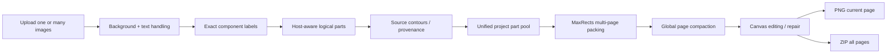
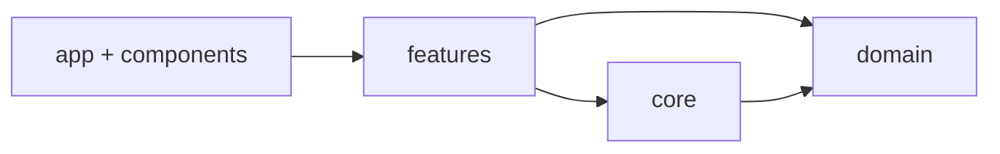

<div align="center">

# Pattern Layout Studio

### Turn one or many pattern sheets into clean, traceable, no-scale print layouts — entirely in the browser.

[](https://github.com/invoidstar/pattern-layout-studio)
[](https://react.dev/)
[](https://www.typescriptlang.org/)
[](https://vite.dev/)
[](https://invoidstar.github.io/pattern-layout-studio/)

**[Open the live app →](https://invoidstar.github.io/pattern-layout-studio/)**

</div>

---

## What is it?

Pattern Layout Studio is a browser-based workspace for turning illustrated pattern sheets into production-ready page layouts.

Instead of manually cutting every part, cleaning masks, tracking where each piece came from, and trying to fit everything onto output pages, the app combines the full workflow:

> **multi-image input → exact part extraction → source provenance → global page packing → manual repair → PNG / ZIP export**

The project is designed around one strict constraint:

> **Parts are repositioned, never resized by the packing system.**

---

## Highlights

| | Capability | What it does |
| --- | --- | --- |
| 🖼️ | **Multi-image project** | Upload multiple PNG/JPEG/WebP files at once and pack all extracted parts together. |
| ✂️ | **Exact shape extraction** | Uses connected-component labels and exact local masks instead of treating a bounding rectangle as the part. |
| 🎨 | **Original RGB preservation** | Keeps enclosed face / garment colours instead of turning similar-to-background colours into alpha holes. |
| 🔎 | **Source Trace** | Click a converted part and see the exact contour it came from on the original source image. |
| 🧩 | **Host-aware grouping** | Keeps internal emblems, facial details and decorative islands attached to the correct logical part. |
| 📄 | **Automatic multi-page layout** | MaxRects + page compaction + cross-page backfill create as few useful pages as possible. |
| ↔️ | **Cross-page editing** | Move selected parts between existing pages or create a new page, with packing validation before commit. |
| 🖌️ | **Repair tools** | Continuous restore brush, eraser, merge, split, lock, delete, Undo and Redo. |
| 📦 | **Production export** | Export the current page as PNG or all pages as ZIP, including PNG DPI metadata. |
| 🔐 | **Browser-first** | Uploaded source images stay in the browser; no application backend is required. |

---

## Workflow



### 1. Import

Select one or multiple source images.

For a multi-image project the sources are processed sequentially to keep browser memory usage under control.

### 2. Extract

Each source goes through:

- robust background estimation
- optional geometry/OCR text filtering
- morphology cleanup
- exact connected-component labeling
- host-aware grouping
- exact local alpha generation
- original RGB recovery
- source contour generation

### 3. Pack

All successful sources contribute their parts to **one global project pool**.

The layout engine then performs:

1. multi-strategy MaxRects
2. automatic page creation
3. whole-page merge attempts
4. later-page → earlier-page backfill
5. page compaction and reindexing

### 4. Refine

Use the workspace to:

- drag parts
- move parts across pages
- change page packing gap
- lock / unlock
- merge / split
- restore original pixels with the brush
- erase alpha
- Undo / Redo

### 5. Export

Supported target canvases:

- **3500 × 3500**
- **2970 × 2100**

Export options:

- current page → PNG
- all pages → ZIP
- configurable DPI
- PNG `pHYs` metadata
- no-scale placement

---

## Source Trace

Every automatically extracted part stores its original source relationship.

For a normal part:

```text
PatternPart
  └─ sourceId
      └─ SourceRegion
          ├─ original crop box
          └─ exact contours
```

For parts merged across different originals, provenance stays separated by source image. Coordinates from Source 1 and Source 2 are never incorrectly merged into one coordinate system.

The left panel lets you switch between **S1 / S2 / S3 / ...** and inspect the exact contribution from each source.

---

## Page layout engine

Pattern Layout Studio uses **no-scale MaxRects packing**.

V1.6+ adds global optimization on top of the first greedy page solve:

- try to merge complete later pages into earlier pages
- backfill individual smaller parts into unused earlier-page space
- re-run a complete MaxRects validation after every accepted move
- remove empty pages automatically

Manual page transfer uses the same rule:

> the move only commits when the full destination page can still be packed without scaling.

---

## Repair editor

The Canvas workspace includes:

- **Select** — drag and multi-select
- **Restore brush** — continuously paints original unmasked RGB back into the part
- **Eraser** — continuously removes alpha
- **Merge** — creates one logical part from multiple selected parts
- **Split** — atomically replaces one part with its disconnected child regions
- **Lock / Unlock**
- **Delete**
- **Undo / Redo**

Automatic crops include a repair margin so edge pixels can be recovered instead of being permanently clipped.

---

## Architecture

V1.8 reorganized the codebase into explicit layers.

```text
src/
├─ app/            application orchestration and configuration
├─ components/     React UI panels and widgets
├─ core/
│  ├─ vision/      image / mask / contour algorithms
│  ├─ layout/      packing and placement algorithms
│  └─ export/      PNG / ZIP output
├─ domain/         shared domain types
├─ features/
│  ├─ extraction/  one-source processing workflow
│  ├─ project/     multi-source project construction
│  ├─ layout/      project/page layout orchestration
│  ├─ provenance/  source-region handling
│  ├─ editor/      image utilities
│  └─ debug/       diagnostic previews
└─ styles/         application styles
```

The dependency direction is intentionally simple:



See **[docs/ARCHITECTURE.md](docs/ARCHITECTURE.md)** for the full breakdown.

---

## Quick start

### Requirements

- Node.js 20+
- npm

### Development

```bash
git clone https://github.com/invoidstar/pattern-layout-studio.git
cd pattern-layout-studio
npm install
npm run dev
```

### Production build

```bash
npm run build
npm run preview
```

GitHub Pages deployment is handled by:

```text
.github/workflows/pages.yml
```

---

## Current project capabilities

### Extraction

- solid / near-solid background estimation
- JPEG noise tolerance
- text exclusion
- optional English + Simplified Chinese OCR
- morphology cleanup
- exact label-based part masks
- smooth antialiased contours
- internal RGB preservation
- internal-decoration grouping

### Project / layout

- one or many source images
- unified part pool
- multi-page packing
- page utilization metrics
- adjustable part gap
- global page compaction
- manual cross-page transfer
- automatic dedicated page for near-canvas-size parts

### Provenance

- source IDs
- exact original-image contours
- source-image browser
- multi-source merged-part provenance
- split provenance refinement

### Export

- PNG
- ZIP
- 3500×3500
- 2970×2100
- configurable DPI
- `pHYs` metadata

---

## Traffic statistics

The deployed site includes a lightweight **Busuanzi** visitor counter in the footer.

It displays:

- site UV — unique visitors
- site PV — total page views

The counter is loaded as a small optional client-side widget and is isolated from the image-processing pipeline.

---

## Version history

| Version | Focus |
| --- | --- |
| **V1.8** | Modular code architecture, showcase README, traffic widget |
| **V1.7** | Multi-image projects and unified cross-source page packing |
| **V1.6** | Cross-page transfer, global page compaction, workspace redesign |
| **V1.5** | Exact shape masks, RGB preservation, split/brush fixes |
| **V1.4** | Source Trace and three-pane workspace |
| **V1.3** | Automatic multi-page packing and ZIP export |
| **V1.2** | Text exclusion, smooth contours, manual repair |
| **V1.1** | Real-image stability and MaxRects Packing V2 |

Detailed implementation and acceptance notes are available under **[`docs/`](docs/)**.

---

## Privacy & processing model

Pattern Layout Studio is intentionally browser-first.

- source images are processed locally in the browser
- source files are not uploaded to the repository
- no application server is required
- optional OCR downloads the OCR runtime/language assets only when enabled
- Busuanzi traffic counting is separate from image content and processing

---

<div align="center">

### Pattern Layout Studio

**Clean parts. Keep provenance. Pack pages. Export.**

[Live Demo](https://invoidstar.github.io/pattern-layout-studio/) · [Architecture](docs/ARCHITECTURE.md) · [V1.8 Acceptance](docs/V1.8_ACCEPTANCE.md)

</div>
