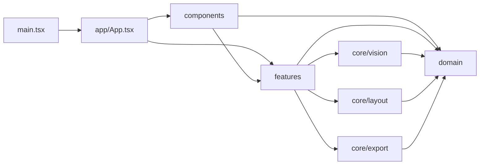

# Architecture

Pattern Layout Studio V1.8 is organized around one rule:

> UI orchestrates features; features compose domain/core modules; core modules do not depend on UI.

## Directory structure

```text
src/
├─ app/
│  ├─ App.tsx                 # application orchestration / state
│  └─ config.ts               # output targets and app defaults
├─ components/
│  ├─ CanvasPanel.tsx         # canvas workspace
│  ├─ CommandBar.tsx          # upload / processing / export controls
│  ├─ InspectorPanel.tsx      # page transfer / diagnostics / part list
│  ├─ SourcePanel.tsx         # source browser and exact provenance overlay
│  └─ TrafficStats.tsx        # Busuanzi PV / UV widget
├─ core/
│  ├─ vision/
│  │  ├─ background.ts
│  │  ├─ segmentation.ts
│  │  ├─ morphology.ts
│  │  ├─ contour.ts
│  │  ├─ alpha.ts
│  │  ├─ text-filter.ts
│  │  └─ ocr.ts
│  ├─ layout/
│  │  ├─ packing.ts
│  │  └─ converter.ts
│  └─ export/
│     ├─ pages.ts
│     └─ png.ts
├─ domain/
│  └─ types.ts                # PatternPart / SourceRegion / CanvasSize
├─ features/
│  ├─ debug/
│  │  └─ previews.ts
│  ├─ editor/
│  │  └─ image-utils.ts
│  ├─ extraction/
│  │  └─ process-source.ts
│  ├─ layout/
│  │  ├─ project-layout.ts
│  │  └─ page-editor.ts
│  ├─ project/
│  │  ├─ build-project.ts
│  │  └─ model.ts
│  └─ provenance/
│     └─ source-regions.ts
├─ styles/
│  └─ app.css
└─ main.tsx
```

## Dependency direction



## Core layers

### `core/vision`

Pure image-processing responsibilities:

- robust background model
- foreground mask
- text filtering / OCR
- morphology
- component labels
- host-aware grouping
- contour tracing
- exact alpha generation

It does not know about React, pages, or the application UI.

### `core/layout`

No-scale geometric placement:

- MaxRects
- multi-page packing
- global page compaction / backfill
- centering
- fit validation

### `core/export`

Output-only responsibilities:

- render a page to PNG
- inject DPI `pHYs` metadata
- build all-pages ZIP

## Feature layer

Features compose multiple core modules into user-facing workflows.

### `features/extraction`

Processes one source image end-to-end and returns:

- `PatternPart[]`
- source provenance
- diagnostics
- debug previews

### `features/project`

Builds a complete multi-image project.

It processes sources sequentially, combines all parts, performs one unified global layout, and aggregates diagnostics.

### `features/layout`

Contains project/page-specific orchestration that is above the raw packing algorithm:

- place all project parts across pages
- validate manual page transfer
- normalize page indices

### `features/provenance`

Keeps source-image coordinate systems isolated when parts are split or merged.

## App layer

`app/App.tsx` owns application state and interactive commands:

- project state
- selection
- undo / redo
- canvas pointer interaction
- merge / split
- cross-page transfer
- export commands

Visual rendering is delegated to `components/*`.

## Data invariants

The architecture keeps several invariants explicit:

1. **No scale** — packing never changes part width/height.
2. **Source-space isolation** — coordinates from different source images are never unioned into one coordinate system.
3. **Exact membership** — a logical part uses component labels/masks, not all foreground inside a bounding box.
4. **Browser-local source data** — original images remain local to the browser.
5. **Validated page moves** — a cross-page move only commits after the destination page passes a full packing solve.

## Extension points

New functionality should normally enter one of these layers:

- new image algorithm → `core/vision`
- new packing strategy → `core/layout`
- new file output → `core/export`
- new end-to-end workflow → `features/*`
- new visible panel/control → `components/*`
- new application state/action → `app/App.tsx`
