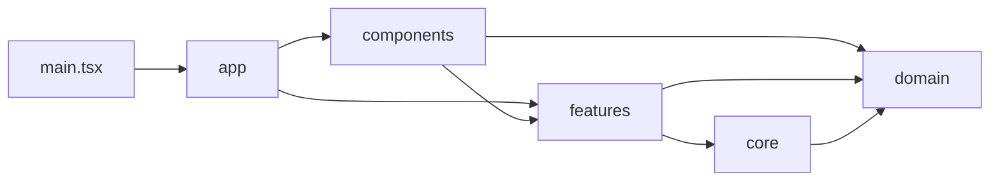

# Pattern Layout Studio · Architecture

Pattern Layout Studio V2.1 follows a simple dependency rule:

> UI orchestrates features; features compose domain/core modules; core modules do not depend on React or website UI.

## Source structure

```text
src/
├─ app/
│  ├─ App.tsx                   # Application state and editor orchestration
│  └─ config.ts                # Target sizes and application defaults
├─ components/
│  ├─ AnnouncementCenter.tsx   # Update notices and version history
│  ├─ AppHeader.tsx            # Site navigation
│  ├─ CanvasPanel.tsx          # Canvas / editing tools / viewport controls
│  ├─ CommandBar.tsx           # Import / settings / export drawer
│  ├─ InputSizeNotice.tsx      # Invalid source size dialog
│  ├─ InspectorPanel.tsx       # Part list and manual page management
│  ├─ MobileNavigation.tsx     # Mobile Canvas / Source / Parts tabs
│  ├─ SourcePanel.tsx          # Original images and exact contours
│  └─ ui/Icon.tsx              # UI icons
├─ content/
│  └─ announcements.ts         # Typed release notes
├─ core/
│  ├─ vision/                  # Background, masks, OCR, contours, alpha
│  ├─ layout/                  # MaxRects, page compaction, fit checking
│  └─ export/                  # Page rendering, PNG metadata, ZIP
├─ domain/
│  └─ types.ts                 # Parts / source regions / canvas sizes
├─ features/
│  ├─ debug/                   # Diagnostic previews
│  ├─ editor/                  # Image utilities
│  ├─ export/                  # Export-only background choices
│  ├─ extraction/              # Per-image processing, dimension validation
│  ├─ layout/                  # Project and manual-page layout
│  ├─ project/                 # Multi-source batch workflow
│  └─ provenance/              # Source-safe merge/split coordinates
├─ hooks/
│  └─ useCanvasViewport.ts     # Visual-only pan / zoom controls
├─ services/
│  └─ analytics/               # Optional interface, disabled by default
├─ styles/                     # Tokens, base, workbench and responsive CSS
└─ main.tsx                    # React entry point
```

## Dependency direction



### Core algorithms

- `core/vision` owns foreground extraction, smoothing, exact mask membership, text removal, and alpha/contour rendering.
- `core/layout` owns MaxRects, cross-page backfill/compaction, centering, and no-scale validation.
- `core/export` owns PNG rendering, DPI metadata, and multi-page ZIP serialization.

### Feature workflows

- `features/extraction`: process one accepted source image and return parts, masks, provenance, and diagnostics.
- `features/project`: handle multi-image batches and collect all eligible parts into one layout project.
- `features/layout`: apply project-wide and manual-page placement rules.
- `features/provenance`: maintain independent coordinates for multiple source images.
- `features/export`: resolve a background selection for download without altering the editor.

### Application and UI

`app/App.tsx` maintains selection, Undo/Redo state, source choice, current page, and editor events. UI surfaces are composed from `components/*` and the responsive stylesheets.

Announcements are data-driven: the latest release is read from `content/announcements.ts`, while the dismissal state is stored locally in the visitor's browser.

## Invariants

1. **No implicit part scaling:** packing never changes extracted part dimensions.
2. **Exact extraction:** part ownership comes from component labels and masks, not entire bounding rectangles.
3. **Source-space isolation:** regions from different input images retain their original coordinates.
4. **Export-only backgrounds:** selected background color or transparency affects PNG/ZIP generation, not the original artwork or editor mask.
5. **Browser-local processing:** input image pixels are processed in the browser.
6. **Validated cross-page movement:** a manual page transfer is committed only when the destination remains packable.
7. **Optional analytics:** the interface is disabled until a future independent service is explicitly configured.

## Official deployment

**GitHub Pages is the project's only production hosting and deployment channel.**

1. Changes are merged into the repository's `main` branch.
2. `.github/workflows/pages.yml` runs typechecking and the Vite production build.
3. GitHub Actions uploads the resulting artifact and deploys it to Pages.
4. The published application is available at [invoidstar.github.io/pattern-layout-studio](https://invoidstar.github.io/pattern-layout-studio/).

No alternate production hosting setup is maintained or documented.

## Maintenance and verification

GitHub Actions validates the TypeScript build before deployment. Automated Chromium smoke tests in `tests/` cover responsive navigation, the extraction workflow, source-size gating, and export behavior. These checks supplement real-image/manual validation.
